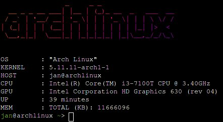

# uglyfetch
Fetcher for Linux. Made in like 30 minutes and ugly AF.


# Requirements
- Figlet
- Lolcat
- Git
- Inetutils
- Pciutils
# Installation
Install all of the requirenments first (package names may vary by distro). Next, clone the repository and install like this:
```
git clone https://github.com/JBGMR/uglyfetch.git && cd uglyfetch && sh install.sh
```
If you are on Arch run the following line to install all the requirements and the progran itself:
```
git clone https://github.com/JBGMR/uglyfetch.git && cd uglyfetch && makepkg -si
```
To run the program type ``uglyfetch``
# Removing
Execute the following:
```
sudo rm /bin/uglyfetch
```
# Notice
If something goes wrong or you have suggestions, please open an issue on GitHub. It really means a lot to me. thanks!

